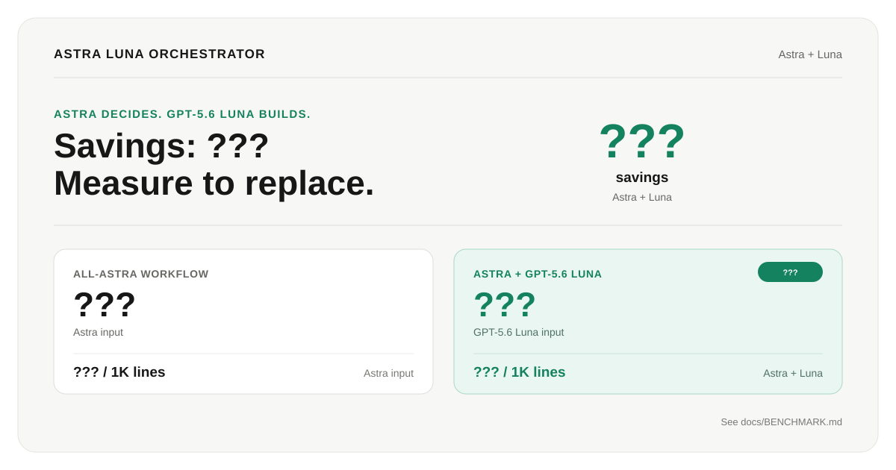

# Astra Luna Orchestrator

**Save Astra for the decisions that need it. Let GPT-5.6 Luna do the volume.**



A personal Codex skill designed to preserve Astra usage without giving up Astra's
judgment. Astra stays responsible for planning, architecture, high-stakes
decisions and final review. GPT-5.6 Luna takes the high-volume work:
repository discovery, implementation, testing, debugging and routine verification.

Bring an existing plan or start with a feature request. The workflow turns it
into coherent implementation bundles, sends those bundles to Luna, then returns
the completed patch and evidence to Astra for one focused acceptance pass.

> **Status:** early release. Offline installation tests pass. Astra + GPT-5.6 Luna savings remain `???` until measured. A new installation still needs runtime model-selection verification on its first authorized task. Installation never runs paid inference.

## Savings

| Metric | Astra + GPT-5.6 Luna |
| --- | ---: |
| Savings | **???** |
| Quality | **???** |
| Latency | **???** |
| Cost | **???** |

Replace the placeholders after measuring. See the [benchmark](docs/BENCHMARK.md).

## How it works

```text
Astra  →  scope + design + task brief
Luna  →  implement + test + report
Astra  →  review + verify + accept or request fixes
       →  integrate + checkpoint + next task
```

- **Native delegation:** uses the `astra_luna_builder` role, not a separate agent CLI.
- **Coherent assignments:** one feature slice can include many edit/test/fix steps.
- **Focused Astra root:** normally one planning batch, one dispatch, one wait, one
  batched acceptance review and one final response.
- **Worker-owned execution:** Luna handles in-scope discovery, implementation,
  testing, debugging and routine browser/visual QA without progress polling.
- **Review before acceptance:** the builder submits evidence; Astra decides whether it is complete.
- **Existing plans welcome:** works with repository plans, Superpowers/GSD artifacts, or the included templates.
- **Controlled parallel work:** one writer by default; two only with independent tasks and verified separate workspaces.
- **Reversible installation:** dry run, backups and a guarded undo receipt.

This is workflow guidance, not a deterministic scheduler, a security sandbox, or a guarantee of model quality or cost savings.

### One orchestration workflow

There is no mode setting or mode-switch command. The package always uses the
usage-saving Astra → Luna → Astra workflow for substantial implementation.

Three routing outcomes remain intentionally different:

- Substantial implementation uses Astra to plan and review while Luna builds.
- Trivial work and explicit single-agent requests stay with the root session.
- Concrete security, architecture, payments, tenancy, secrets, migration or
  production risk can justify targeted additional Astra review.

Those are scope and safety decisions, not user-selectable performance modes.

## Requirements

Before installing, you need:

1. A Codex client that supports native subagents and standalone custom agent TOML files under `$CODEX_HOME/agents/`.
2. GPT-6 Astra selected as the root model.
3. Python **3.11 or newer**. No third-party Python dependencies are needed.
4. Native OpenAI access to `gpt-5.6-luna` and native subagent support.

The installer pins the personal role directly to the native Codex model. It does
not ask for, read, store or validate API keys, and it never runs model requests.
Do not paste credentials into assistant chat.

Do **not** add or change `[agents].default_subagent_model` for this package. The
installer creates a named `astra_luna_builder` role that pins `gpt-5.6-luna` at
`xhigh`, so unrelated subagents keep their existing defaults. The installer does
not select your root model or rewrite `config.toml`.

## Install

Download this repository as a ZIP and extract it, or clone it:

```sh
git clone https://github.com/ethanplusai/astra-luna-orchestrator.git
cd astra-luna-orchestrator
```

Run the following commands from that repository folder.

### Fastest safe terminal install

The installer performs its own prerequisite checks before writing. Preview the
exact destinations, then apply:

```sh
python3 -B install.py
python3 -B install.py --apply
```

That is the normal installation path. The first command changes nothing. The
second repeats preflight, installs atomically, backs up existing instructions and
prints a guarded undo receipt. It does not change your root model, credentials,
permissions or reasoning effort.

### With Codex

Ask Codex:

```text
Read INSTALL-IN-CODEX.md in this folder and install the package following it.
Preserve my root model, reasoning effort, config and authentication.
Do not launch workers or run paid inference during installation.
```

### Verify the package locally

Release archives are tested before publication. If you also want to run the
offline suite yourself:

```sh
python3 -B -m unittest discover -s tests -v
```

For a nondefault profile, pass `--profile PROFILE` to the dry run, apply and doctor consistently. `--home` and `--codex-home` are available for explicit location overrides. Use the same locations for undo.

### What changes

| Location | Installed content |
| --- | --- |
| `~/.agents/skills/astra-luna-orchestrator/` | Skill, references, templates, doctor and plan validator |
| `$CODEX_HOME/agents/astra_luna_builder.toml` | Native builder pinned to GPT-5.6 Luna at xhigh; nested agents disabled |
| `$CODEX_HOME/AGENTS.md` | A marked, scoped workflow policy block |
| `$CODEX_HOME/astra-luna-install-backups/` | Original files and an undo receipt |

`CODEX_HOME` defaults to `~/.codex`. An existing nonempty `AGENTS.override.md` receives the policy instead of `AGENTS.md`. Other instructions are preserved. The policy keeps trivial work single-agent and honors explicit no-delegation requests, repository restrictions and managed policies. Use `--no-policy` for a skill/role-only installation.

Root model/effort, provider configuration, authentication and existing permissions stay unchanged. Installation does not start workers or model requests, and does not commit, push or deploy anything.

## Start your first task

**Fully quit and reopen the host app (ChatGPT or Codex), then start an Astra session.** Use:

```text
$astra-luna-orchestrator Use the existing plan in docs/plan.md to implement
this feature. Keep Astra focused on planning and final review. Use one installed
Luna builder for a coherent implementation and verification bundle. Do not poll
the worker; review its completed patch and evidence in one batched pass.
```

Replace the example plan path with your actual plan or describe the feature. Your first authorized useful task should verify the child model and effort using host session metadata. A worker saying its model name is not proof.

If the session does not expose the custom role or exact worker model, do not substitute another model or launch a second CLI. Check client support and session configuration first.

## Check your setup

From the repository folder:

```sh
python3 -B skill/astra-luna-orchestrator/scripts/doctor.py
```

The static check verifies the effective config shape, root settings and native
worker binding. It does not prove runtime delegation. See [troubleshooting](docs/TROUBLESHOOTING.md) and [validation evidence](docs/VALIDATION.md).

## Updating and uninstalling

For an update, download the new source, run its tests, and preview `python3 -B install.py --replace`. Review the differences before applying with `--replace --apply`. Existing package-owned files are backed up; unrelated files are not deleted.

Preview undo using the exact receipt printed during installation:

```sh
python3 -B install.py --undo /path/to/receipt.json
```

Add `--apply` to restore. Undo refuses if a managed file changed afterward, protecting later edits. Backups remain available. Keep a copy of the installer and receipt; receipts may contain private paths and original instructions and should never be published.

## Contributing and distribution

- [Contributing](CONTRIBUTING.md): tests, changes and evidence expectations.
- [Security](SECURITY.md): privacy boundaries and safe reporting.
- [Sources](SOURCES.md): provenance and upstream references.
- [Release preparation](docs/RELEASE.md): GitHub description, topics and release checks.
- [Changelog](CHANGELOG.md): changes from the original package.

To validate the synthetic plan example:

```sh
python3 -B skill/astra-luna-orchestrator/scripts/validate_plan.py examples/invoice-filter/plan.json
```

The example is a planning fixture, not a runnable application. Markdown plans work without the optional manifest validator.
